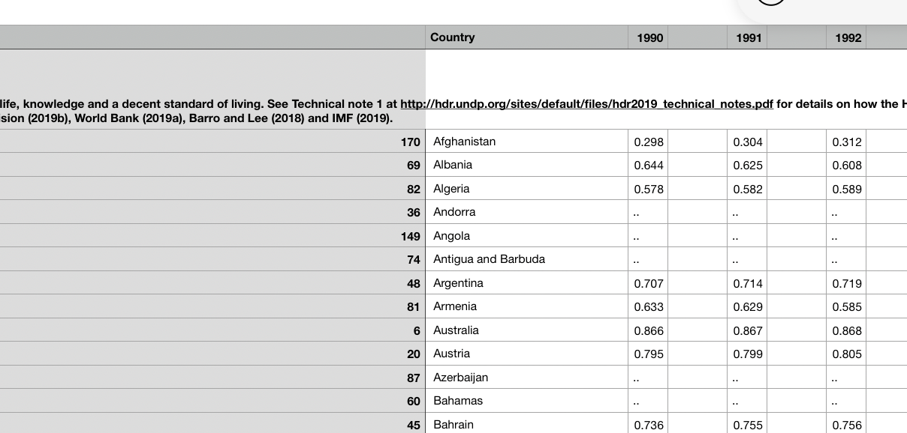
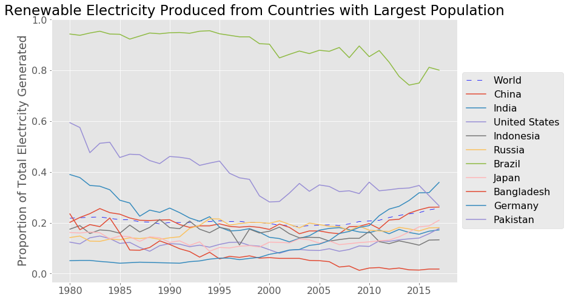
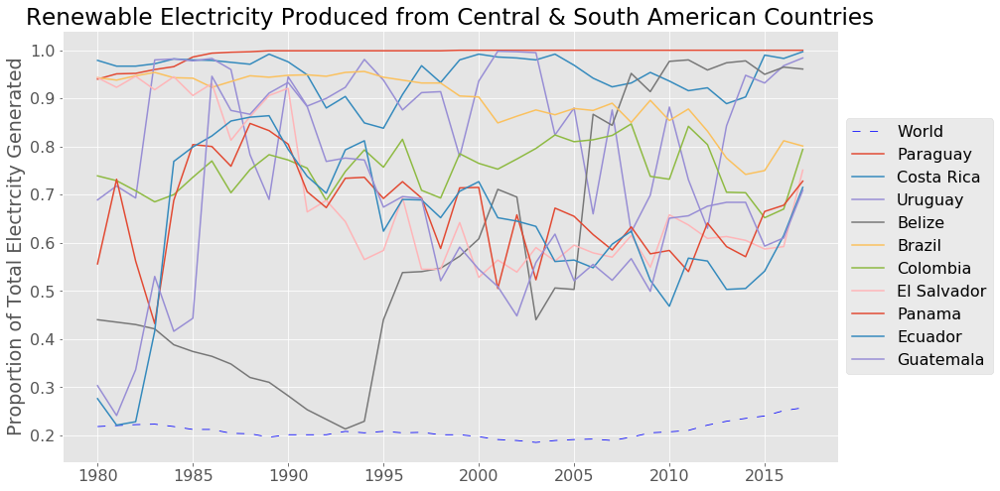
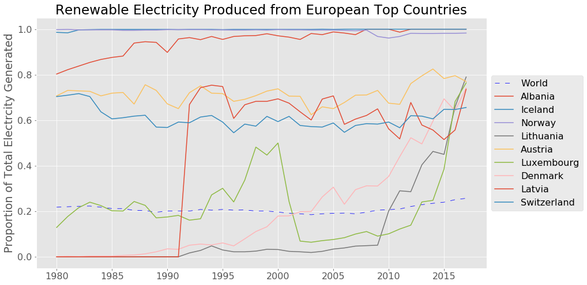
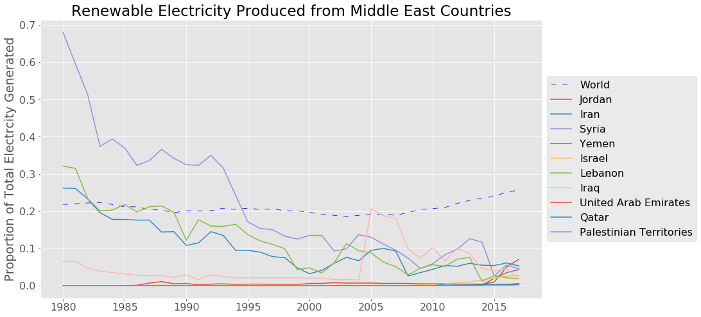
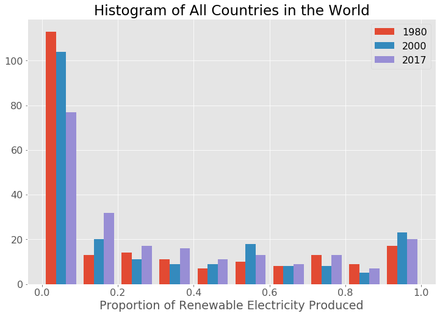

#  Transition to Renewable Electricity Resources Around the World: Are Countries Around the World Moving Towards Resources for Renewable Electricity?

This day in age, we are more dependent on electricity than ever before, and that doesn't seem to be changing any time soon. It is well known that the world population is growing, and with that rate energy demands are increasing. However, with the depletion of nonrenewable resources and climate change, how much of a priority is the transition to renewable resources for electricity for countries around the world? I was curious to see if there are any specific trends in regions around the world, and if the more developed countries are making this issue a priority and preparing for the future. I also explored if there are specific trends in certain areas of the world in terms of their proportions of renewable to total electricity generation.

# Data + Cleaning
I used three datasets for this study, each of which needed to be cleaned. The Energy Information Administration (EIA) has released a dataset of the types and quantity of electricity generation of countries around the world from years 1980 to 2017, which was the main resource I used for this study. An issue I came across was indented strings as row entries in the energy dataset used to represent different data based on the indentation, which  and many missing values. Missing data values were assumed to be zero. Also, many countries since 1980 have changed names, dissolved into other countries, and were slightly different between datasets, making it difficult to link data from one to the other. This was definitely the most time consuming aspect of this project, but my code can now analyze and make plots and histograms for any list of countries that are inputted. 

 I also used the United Nations Human Development Index to take a sample of the most highly developed countries in the world for my analysis. My primary goal of this study was to determine if the countries that have the resources to do so are transitioning to renewable resources for electricity, and I believe that the development index is a good indicator of that. This dataset for some reason contained empty columns in every other column, which were easily dropped. The only struggle with this dataset is the names of some countries are spelled slightly different than the other dataset, making linking them for analysis somewhat difficult. My code outputs a message when a country isn't found, so I can rename them between datasets so that they are consistent. 

I also used the World Population dataset from the World bank to analyze if the most populated countries in the world were transitioning their energy. This data was mostly clean and didn't present many issues other than some country name inconsistencies.

# Question and Hypothesis
Based on the aggregated proportion of renewable electricity proprtion of all countries shown below, it does seem like there is a general increase in renewable electricity being produced, especially in recent years. However, does this trend hold true for countries around the world?

Are the most developed countries in the world transitioning to renewable resources for electricity?

My null hypothesis is that there is no difference in the proportion of electricity produced from renewable resources to total generation in 2017 of developed countries was the same or less than it was in 1980. My alternative hypothesis is that the proportion is greater in 2017. I used a significance level of 5%.

I also ran a hypothesis test for regions of the world to determine if there was enough statistical significance to suggest that the proportion was higher in 2017 than 1980 for the specified regions.

# Exploratory Data Analysis

 The main goal of this project was to investigate the top developed countries. The top ten developed countries and their proportions are plotted above. There is a very wide spread but some increases. Since there is some variance in the data, I took the data from 1980 to 1983 and averaged it, using this as the before value, and averaged the data from 2014 to 2017 as the after value of each country. I then used these values for the top 35 most developed countries in the world in my hypothesis test.

 The data returned a p-value of 0.344, much too high to reject the null hypothesis for any reasonable significance value. Therefore there is insufficient evidence to suggest that the Top Developed Countries are generating a greater proportion of electricity in 2017 than in 1980.

 I performed a slightly hypothesis test on this data as well. I counted whether each country in the dataset improved their proportion by at least 15% in the time period. Then, I used this in a binomial test, with a null hypothesis that equal or less than 50% of developed countries have improved their renewable proportion by at least 15%, and an alternative hypothesis that more than 50% (the majority) of countries are making the change. I obtained a p-value of .059, which is close, but still too high to reject with a significance level of 5%, so I failed to reject the null hypothesis in this case as well.

Looking at countries with the highest population in the world, there does not appear to be much improvement over the years as well. Running a hypothesis test with the aggregated data of this subset returned a P-value of 0.53, which makes sense with the data shown.

In the North American subset of countries, again, not much of a difference between the years. P-value = 0.33

It does appear that the top South American countries have high proportions, but there is a lot of fluctuations and few drastic changes in each specfic country.
P-value = 0.495

The top European countries seem to show an upwards trend. The P value is smaller than any of the groups, but is still too high to reject the null hypothesis.
P-value = 0.25

This dataset presented a challenge - the Eurasian countries were formed from Former USSR in 1992, so I used that as the minimum year instead of 1980. When using 1980 I achieved a very low P value that was more than sufficient to reject the null hypothesis, but I believe the data was flawed. The separation into several smaller countries gave a sudden rise in the proportions of said countries and a very large improvement was calculated.
P - value (from 1992 onward) : 0.485

The Middle East shows a strong negative trend, and that less renewable resources are being used for electricity. Since the middle east is home to many oil reserves, it makes sense they would use that instead of seeking renewable resources instead. The high P-value is consistent with this.

P - value = 0.65

Looking at Asia/Oceania countries, again, there seems to be a great deal of fluctuation as well. 

P - value: 0.461

A histogram of the countries of the world shows not much improvement over the years, as well. It does appear that, at the lower end, the number of countries that produce 0% of their electricity with renewable resources seems to dropping.

I plotted the countries with the top 10 highest proportions in 2017 on this map. Although there are a couple that are clustered in one section, there is a very large spread all around the world. Some of the countries in the top 10 are developed, some are developing.

Since I was unable to reject my null hypothesis in any of these subsets of countries, I explored just how much of an improvement we would need to see in order to reject the null hypothesis. To do this, I pulled a subset of the countries with the greatest increase in proportion over the time period. In order to get a p-value of less than 0.05, I had to pull a subset of countries that observed at least a 27% increase in proportion - only 11 countries in the world have had this much of an improvement!

Country         % Increase from 1980 to 2017
Denmark           0.740
Luxembourg        0.635
Bhutan            0.625
Belize            0.521
Ecuador           0.439
Guatemala         0.406
United Kingdom    0.309
Germany           0.308
Uruguay           0.295
Guinea            0.280
Ethiopia          0.273

# Conclusion

Unfortunately, it looks like there is not sufficient evidence to support the claim that countries around the world are producing a greater proportion of renewable electrity to total electrical generation. Although some regions ended up with a lower P-value and therefore were closer than others to rejecting the null hypothesis, the differences found were not statistically significant enough to reject the null hypothesis.

I find this conclusion alarming, as our resources are rapidly diminishing and was hoping to see more of a change throughout the world. Although the dataset's most recent complete data is from 2017, hopefully an upward trend will occur through the coming years and the world can move towards a more sustainable future.

# Data Sources: 
World Energy Use:
​https://www.eia.gov/international/data/world

World Population:
https://data.worldbank.org/indicator/sp.pop.totl

United Nations Human Development Index
http://hdr.undp.org/en/indicators/137506
